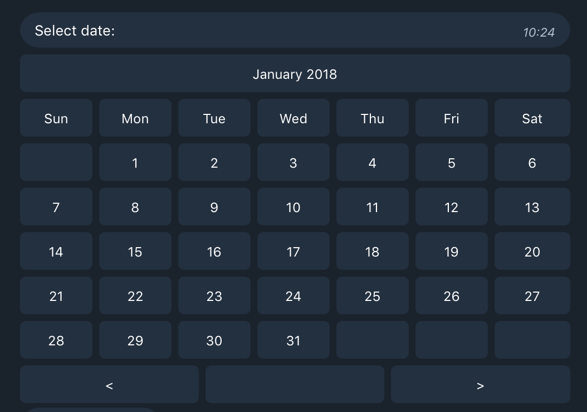

# CalendarPicker

Simple Example Bot with CalendarPicker control. Based on [Telegram.Bot.Framework](https://github.com/TelegramBots/Telegram.Bot.Framework)

Just modify appsettings.json and run.

Calendar control supports basic internationalization - you can specify preferred regional settings in [DateCulture](https://github.com/karb0f0s/CalendarPicker/blob/a47a52e3f6c5af7316acad896913ac21e9b98481/CalendarPicker/CalendarControl/Common/Constants.cs#L7). This would change date format, first day of week and weekdays names.

